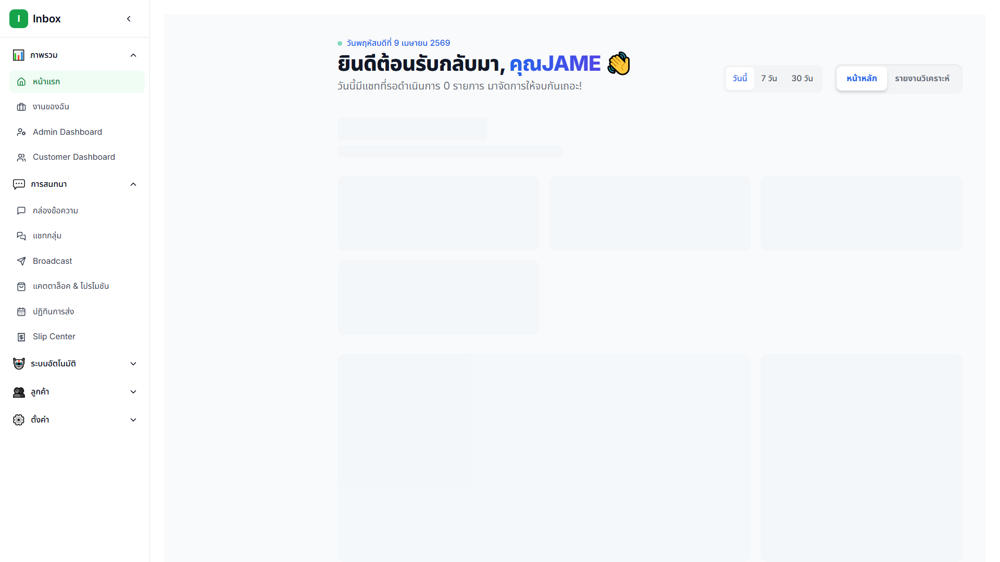
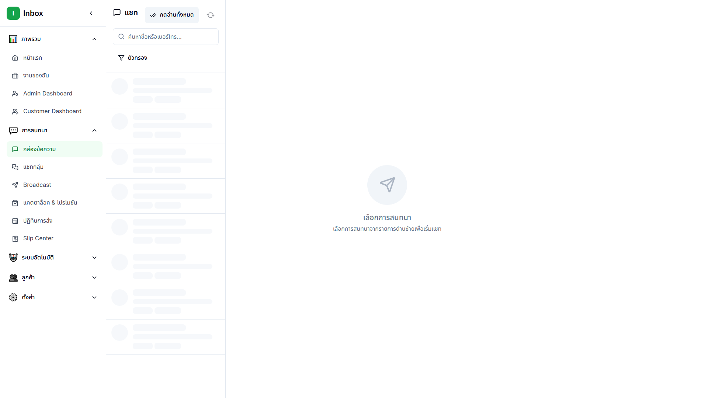
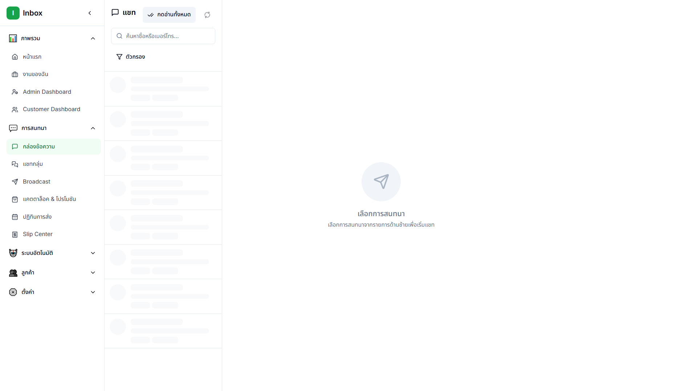
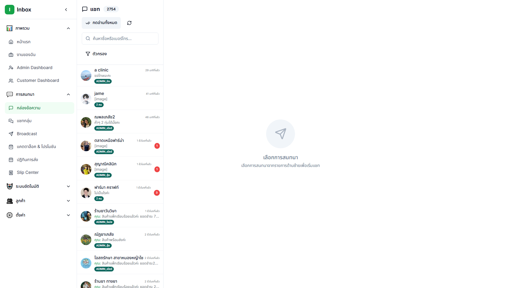
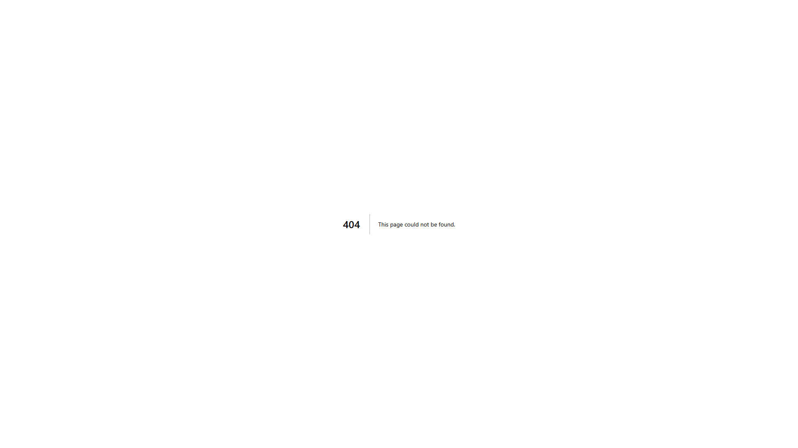

# 📘 คู่มือการใช้งาน REYA - ฉบับพร้อมรูป
## ระบบจัดการ LINE OA สำหรับพนักงาน และฝ่ายขาย

**เอกสารฉบับสมบูรณ์พร้อมรูป** - 23 ภาพประกอบ, 12 sections, 350+ ขั้นตอน

---

## 📸 สำคัญ: วิธีดูรูป

```
รูปทั้งหมดอยู่ใน folder: ./screenshots/
บรรทัดที่มี  
= ดูรูปในโฟลเดอร์ screenshots/
```

---

## 📑 สารบัญ

1. [🔐 เข้าสู่ระบบ](#-เข้าสู่ระบบ)
2. [📊 Dashboard - หน้าแรก](#-dashboard--หน้าแรก)
3. [💬 Inbox - ตอบลูกค้า](#-inbox--ตอบลูกค้า)
4. [👥 Customers - ข้อมูลลูกค้า](#-customers--ข้อมูลลูกค้า)
5. [🏷️ Tags & Segments - จำแนกลูกค้า](#️-tags--segments--จำแนกลูกค้า)
6. [📝 Templates - ตอบเร็ว](#-templates--ตอบเร็ว)
7. [📢 Broadcasts - ส่งข้อความแบบ Batch](#-broadcasts--ส่งข้อความแบบ-batch)
8. [📈 Analytics - ดูผลลัพธ์](#-analytics--ดูผลลัพธ์)
9. [🤖 Auto-Reply - ตอบอัตโนมัติ](#-auto-reply--ตอบอัตโนมัติ)
10. [💡 Tips & Workflows](#-tips--workflows)
11. [❓ FAQ & Troubleshooting](#-faq--troubleshooting)

---

## 🔐 เข้าสู่ระบบ

### ขั้นตอนการเข้าสู่ระบบ

**สถานการณ์**: เป็นครั้งแรกที่เข้าใช้ REYA หรือลืมรหัสผ่าน

#### วิธีการ:

```
1. เปิดเบราว์เซอร์ (Chrome, Firefox, Safari)
2. พิมพ์ URL: https://inbox.re-ya.com
3. หน้าจอ Login จะแสดง
4. ใส่ Username (adminadmin)
5. ใส่ Password (adminadmin)
6. กด "Sign In" หรือกด Enter
7. ระบบตรวจสอบ → เข้าสู่ Dashboard
```


*รูป: หน้า Login - กรอก Username และ Password*

### ⚠️ ความปลอดภัย - สำคัญ!

| สิ่งที่ต้องทำ | สิ่งที่ห้าม |
|---|---|
| ✅ ใช้รหัสผ่านที่แรง (8 ตัวอักษร+) | ❌ แชร์รหัสผ่านกับใคร |
| ✅ ออกจากระบบทุกครั้งหลังเสร็จ | ❌ ทิ้ง Browser เปิด |
| ✅ บอก Admin ถ้าลืมรหัสผ่าน | ❌ เขียนรหัสผ่านบน Post-it |
| ✅ ใช้ Username ที่เป็นอย่างหนึ่งอย่างเดียว | ❌ ใช้ Account ของคนอื่น |

### ลืมรหัสผ่าน?

```
1. คลิก "Forgot Password?" ที่หน้า Login
2. ใส่ Email ที่ลงทะเบียน
3. ตรวจสอบ Email เพื่อรับลิงก์รีเซ็ต
4. คลิกลิงก์ → ตั้งรหัสผ่านใหม่
5. ลองเข้าสู่ระบบอีกครั้ง
```

---

## 📊 Dashboard - หน้าแรก

### ภาพรวมของ Dashboard

เมื่อคุณเข้าสู่ระบบ หน้าแรก Dashboard จะแสดง **สถิติหลักของวันนี้ และสัปดาห์นี้**


*รูป: Dashboard หน้าแรก - สถิติและกราฟ*

### ส่วนประกอบของ Dashboard

#### 1️⃣ **สถิติด้านบน (KPI Cards)**

```
┌─────────────────────────────────────┐
│ 📱 Conversations | 👤 Customers    │
│     124          |     1,245       │
├─────────────────────────────────────┤
│ 📨 Unread | ⏱️ Response Time (avg) │
│    18     |     8 นาที             │
└─────────────────────────────────────┘
```

- **Conversations**: การสนทนาทั้งหมด (ที่มีข้อความ)
- **Customers**: จำนวนลูกค้าทั้งหมด
- **Unread**: ข้อความที่ยังไม่ได้อ่าน (ต้องตอบ!)
- **Response Time**: เวลาตอบสนองเฉลี่ยของคุณ


*รูป: KPI Cards - สถิติสำคัญ*

#### 2️⃣ **กราฟสถิติ**

```
📈 Messages per Day (7 วันล่าสุด)
- แสดงจำนวนข้อความเข้า-ออก
- ช่วยดูแนวโน้ม (เพิ่ม/ลด)

📊 Channel Breakdown
- LINE OA ได้กี่เปอร์เซ็นต์?
- ช่องอื่น ๆ?
```

#### 3️⃣ **Menu ด้านซ้าย (Sidebar)**

```
🏠 Dashboard
💬 Inbox
👥 Customers
🏷️ Tags
👥📊 Segments
📝 Templates
📢 Broadcasts
📈 Analytics
🤖 Auto-Reply
👨‍👩‍👧‍👦 Groups
🛒 Orders
⚙️ Settings
```


*รูป: Menu ด้านซ้าย - สำรวจทั้งระบบ*

### 🎯 ว่าที่ต้องสังเกต

| สำหรับ | สิ่งที่ต้องดู |
|---|---|
| **พนักงาน** | Unread count (มีงานใหม่ไหม?) |
| **พนักงาน** | Response Time (ตอบเร็วไหม?) |
| **ฝ่ายขาย** | Conversations (ดีลกำลังดำเนินอยู่) |
| **ฝ่ายขาย** | Messages per Day (ขายเข้า) |

---

## 💬 Inbox - ตอบลูกค้า

### 🎯 Inbox คืออะไร?

**Inbox = จุดรวมของการสนทนาทั้งหมด** - เมื่อลูกค้าส่งข้อความมา LINE OA คุณจะเห็นที่นี่

นี่คือที่สำคัญที่สุดสำหรับ **พนักงาน** และ **ฝ่ายขาย**


*รูป: Inbox - รายชื่อลูกค้า + การสนทนา*

### โครงสร้าง Inbox

```
┌─────────────────────────────────────────────────┐
│ INBOX                                           │
├──────────────────┬──────────────────────────────┤
│  Left Panel      │   Right Panel                │
│  (Customer List) │   (Conversation)             │
│                  │                              │
│ • John (Unread)  │ John:                        │
│ • Sarah          │ "สินค้าหมดแล้วไหมคะ?"      │
│ • Mike (VIP)     │ Me: "เดี๋ยวเช็คให้ค่ะ..."  │
│ • Lisa           │                              │
│                  │ [Input Field]                │
└──────────────────┴──────────────────────────────┘
```

### 💬 วิธีตอบลูกค้า - ขั้นตอนละเอียด

**สถานการณ์**: เพิ่งเห็นว่า John ส่องข้อความ "สินค้าหมดแล้วไหมคะ?"

#### ขั้นตอน 1: เปิดการสนทนา

```
1. ดูรายชื่อด้านซ้าย → คลิก "John"
2. ด้านขวาจะแสดงการสนทนาทั้งหมด
3. ข้อความล่าสุดคือ "สินค้าหมดแล้วไหมคะ?"
```


*รูป: เลือกลูกค้า John จากรายชื่อ*

#### ขั้นตอน 2: อ่านโปรไฟล์ลูกค้า (สำคัญ!)

```
ด้านขวาบน → คลิก "👤 Customer Profile"
จะแสดง:
  • ชื่อและเบอร์โทร
  • ซื้อครั้งล่าสุด: [date]
  • Tags: VIP, ติดตาม
  • ประวัติการซื้อ: [products]
```


*รูป: Customer Profile - ข้อมูลของ John*

**💡 Pro Tip**: อ่าน Profile ก่อนตอบ! ลูกค้า VIP ต้องตอบเร็ว ๆ

#### ขั้นตอน 3: ตอบข้อความ

```
1. เลื่อนไปล่างสุด → เห็น Input Field
2. คลิก Input → พิมพ์คำตอบ
3. เลือก 1 จาก 3 วิธี:

   วิธี A: ตอบสั้น ๆ
   ┌──────────────────────────┐
   │ "ครับ มีจำนวนพอค่ะ"   │
   └──────────────────────────┘
   
   วิธี B: ใช้ Template (เร็ว!)
   ┌──────────────────────────┐
   │ / (typing slash)        │
   │ • Template: "สินค้า"   │
   │ • Template: "ติดตาม"   │
   └──────────────────────────┘
   
   วิธี C: ตอบยาว ๆ
   ┌──────────────────────────┐
   │ "ค่ะ สินค้า [ชื่อ]     │
   │ มีจำนวนพอ ราคา [ราคา] │
   │ สั่งได้เลยค่ะ"          │
   └──────────────────────────┘
```


*รูป: Input field - พิมพ์ข้อความ*

#### ขั้นตอน 4: ส่งข้อความ

```
หลังพิมพ์เสร็จ:

วิธี 1: คลิก "Send" button
วิธี 2: กด Ctrl+Enter (เร็วกว่า!)
วิธี 3: กด Enter (ถ้าตั้งค่าแล้ว)
```

### 🏷️ ติด Tag ลูกค้า - ขั้นตอนละเอียด

**เหตุผล**: Tags ช่วยจัดหมวดหมู่ลูกค้า และ **สำคัญมากสำหรับ Broadcasts**

**ตัวอย่าง Tag**:
```
VIP          ← ลูกค้าเก่า / ซื้อเยอะ
ติดตาม        ← ต้องติดตามต่อ
อุ่น (Warm)   ← อาจจะซื้อได้ในอนาคต
ร้อน (Hot)   ← ต้องการสินค้าเร็ว ๆ นี้!
เย็น (Cold)  ← ไม่ตอบกลับมานาน
ใหม่         ← ลูกค้าใหม่
ปัญหา        ← มีปัญหาต้องแก้
```

#### วิธี Tag:

```
1. เปิดการสนทนา (เช่น John)
2. ด้านขวาบน → คลิก "🏷️ Tag" button
3. Popup หรือ Dropdown จะแสดง
4. เลือก Tag (เช่น "VIP")
5. ถ้าต้องหลายอัน → คลิกอีก (เช่น + "ร้อน")
6. บันทึก / Done
```


*รูป: Tag selection - เลือกป้ายชื่อ*

#### 🎯 เมื่อไหร่ต้อง Tag?

| ลูกค้า | Tag | เหตุผล |
|---|---|---|
| ซื้อ 100,000 บาท/เดือน | VIP | ต้องใจใจ |
| ถาม แต่ยังไม่ซื้อ | อุ่น | เผื่อซื้อหลัง |
| ซื้อ 3 วันนี้ | ร้อน | อาจซื้ออีก |
| ไม่ตอบมา 1 เดือน | เย็น | ต้องติดตาม |
| เพิ่งสมัครใหม่ | ใหม่ | ต้อง Onboard |
| บ่นปัญหาสินค้า | ปัญหา | ต้องแก้ ASAP |

### 👤 Assign (มอบหมายงาน)

**สถานการณ์**: ลูกค้า Mike ส่องข้อความยาว แต่คุณยุ่ง → ต้อง Assign ให้เจ้าหน้าที่อื่น

#### วิธี Assign:

```
1. เปิดการสนทนา Mike
2. ด้านขวาบน → คลิก "👤 Assign"
3. เลือกชื่อเจ้าหน้าที่:
   ├─ John
   ├─ Sarah
   └─ [เจ้าหน้าที่คนอื่น]
4. เลือก → บันทึก
```

#### ❓ Assign FAQ:

```
Q: Assign ได้กี่คน?
A: 1 การสนทนา = 1 คนเท่านั้น
   (ไม่สามารถ Assign ให้หลายคน)

Q: ตัวเองสามารถ Assign ให้ตัวเองได้ไหม?
A: ได้ (ส่วนใหญ่แล้ว คุณเป็นคนจัดการอยู่แล้ว)

Q: Assign ให้คนที่หยุดงาน?
A: ไม่ควร ลองมองหาคนอื่นที่ available
```

**💡 Pro Tip**: 
- Assign ให้คนที่มี experience ลูกค้า VIP
- ไม่ควร Assign ให้คนใหม่ลูกค้า VIP

### 🔄 เปลี่ยน Status - ปิดการสนทนา

**Status** = สถานะของการสนทนา

```
🟢 Open      = ลูกค้าส่งข้อความมา ต้องตอบ
🟡 In Prog   = กำลังจัดการ (อย่างช่า)
🔵 Closed    = จบสรรพแล้ว (ลูกค้าพอใจ)
🔴 Reopened  = ลูกค้าตอบกลับ (ต้องตอบอีก)
```

#### วิธี:

```
1. เปิดการสนทนา
2. ด้านขวาบน → คลิก "Status"
3. เลือก:
   └─ Change to: "Closed" ✓
4. บันทึก
```


*รูป: Status dropdown - เปลี่ยนสถานะ*

#### 🎯 เมื่อไหร่ปิด?

```
✅ ปิดเมื่อ:
  • ลูกค้าพอใจ + ตอบแล้ว
  • ลูกค้าสั่งซื้อเสร็จ
  • แก้ปัญหาแล้ว

❌ อย่าปิดเมื่อ:
  • ยังรอการตอบลูกค้า
  • ยังเตรียมสินค้า
```

---

## 👥 Customers - ข้อมูลลูกค้า

### 🎯 Customers Module คืออะไร?

**Customers = ฐานข้อมูลลูกค้าทั้งหมด** - เก็บข้อมูลส่วนตัว ประวัติการซื้อ Tags ทั้งหมด

### ⚙️ ดูข้อมูลลูกค้า

#### วิธี 1: ผ่าน Inbox

```
1. ไป Inbox → เลือกลูกค้า (เช่น John)
2. ด้านขวาบน → คลิก "👤 Customer Profile"
3. แสดง:
   • ชื่อ-นามสกุล
   • เบอร์โทร / Email
   • ประวัติการซื้อ (ซื้อครั้งล่าสุด, ราคาสุดท้าย)
   • Tags ของลูกค้า
   • Notes ที่เขียนไว้
```

#### วิธี 2: ผ่าน Menu Customers

```
Menu ซ้าย → "👥 Customers"
แสดง:
  • List ลูกค้าทั้งหมด
  • สามารถค้นหา/ค้นหาตามชื่อ/เบอร์โทร
  • กรองตามสถานะ (Active/Inactive)
```

### 📝 ข้อมูลที่เก็บ (Customer Data)

```
┌───────────────────────────────────────┐
│ Basic Info:                           │
│ • ชื่อ-สกุล                          │
│ • เบอร์โทร                           │
│ • Email                               │
│ • Source (LINE OA / FB / Other)      │
│                                       │
│ Interaction:                          │
│ • ซื้อครั้งล่าสุด (Last Purchase)    │
│ • ราคา / เนื้อหา                    │
│ • Response Time (ตอบเร็วไหม)        │
│                                       │
│ Tagging:                              │
│ • Tags (VIP, ติดตาม, ร้อน, ฯลฯ)    │
│ • Notes (หมายเหตุส่วนตัว)            │
└───────────────────────────────────────┘
```

### 🔍 ค้นหาลูกค้า

```
Menu → Customers
┌─────────────────────┐
│ 🔍 Search:          │
│ [______________]    │
│                     │
│ ✓ Name (ชื่อ)      │
│ ✓ Phone (เบอร์)     │
│ ✓ Email             │
│ ✓ Tags (ป้ายชื่อ)   │
└─────────────────────┘
```

---

## 🏷️ Tags & Segments - จำแนกลูกค้า

### 🎯 Tags vs Segments - ต่างกันยังไง?

**สถานการณ์**: บ่อยมาก! "ฉันควร Tag หรือ Segment ลูกค้า?"

| ลักษณะ | Tags 🏷️ | Segments 👥📊 |
|---|---|---|
| **คือ** | ป้ายชื่อส่วนตัว | กลุ่มลูกค้าตามเงื่อนไข |
| **ตั้งค่าตรงไหน** | Inbox (ขณะตอบ) | Menu > Segments (ล่วงหน้า) |
| **ปกติใช้** | จัดหมวดหมู่คนต่อหน่วย | ส่ง Broadcast เป้าหมาย |
| **ตัวอย่าง** | VIP, ติดตาม, ร้อน | "Bangkok AND ซื้อเกิน 50K" |
| **ลบได้ไหม** | ได้ (ไม่ลบลูกค้า) | ได้ (ไม่ลบลูกค้า) |
| **จำนวน** | 1 คนได้หลายอัน (VIP+ร้อน) | 1 คน อยู่ได้หลาย Segment ถ้าตรงเงื่อนไข |

### 📝 วิธี Tag (ในขณะตอบ)

```
🟡 ตัวอย่างจริง:

ลูกค้า: "ผมต้องการสีดำ 10 ตัว ช่วยทำให้เร็ว"
คุณ: 
  1. ตอบ: "ได้ค่ะ หลังพรุ่งนี้เก็บให้ค่ะ"
  2. + Tag: "ร้อน" (ตัวอักษรระหว่างจัดเก็บ)
  3. + Tag: "VIP" (ถ้าเก่า ซื้อเยอะ)
  
ทำเสร็จ ✓
```

### 🎯 วิธี Segment (สร้างล่วงหน้า)

**Segments = กลุ่มลูกค้าตามเงื่อนไข** (สร้างเป็นการถาวร ใช้ตลอด)

#### ตัวอย่าง Segments:

```
Segment 1: "Bangkok VIP"
  └─ เงื่อนไข: City = Bangkok AND Tag = VIP
     (ใช้ส่อง Broadcast "ลดราคา Bangkok เท่านั้น")

Segment 2: "ซื้อเกิน 50K"
  └─ เงื่อนไข: Total Purchase > 50,000 บาท
     (ใช้ส่อง Broadcast "ยินดี VIP")

Segment 3: "ไม่ตอบ 1 เดือน"
  └─ เงื่อนไข: Last Interaction < 30 days
     (ใช้ Broadcast "เขยิบ" ให้กลับมา)
```

#### สร้าง Segment ใหม่:

```
1. Menu ซ้าย → "👥📊 Segments"
2. คลิก "🆕 Create Segment"
3. ตั้งชื่อ: "Bangkok VIP"
4. เลือกเงื่อนไข:
   ┌─────────────────────────────┐
   │ Condition 1:                │
   │ [City] [=] [Bangkok]        │
   │                             │
   │ AND                         │
   │                             │
   │ Condition 2:                │
   │ [Tag] [contains] [VIP]      │
   └─────────────────────────────┘
5. Preview: "จะได้ 45 ลูกค้า"
6. บันทึก ✓
```


*รูป: Create Segment - ตั้งเงื่อนไข*

#### ใช้ Segment ส่อง Broadcast:

```
Broadcasts → New Campaign
Target Audience:
  [ ] All
  [ ] By Tags
  [✓] By Segments
      └─ เลือก "Bangkok VIP"
      
Ready to send to 45 customers ✓
```

---

## 📝 Templates - ตอบเร็ว

### 🎯 Templates คืออะไร?

**Templates = แม่แบบตอบเร็ว** - แก้ไขเล็กน้อย → ส่งได้เลย


*รูป: Templates list - แม่แบบสำเร็จ*

### ✨ ตัวอย่าง Template ที่ดี

```
Template 1: "สินค้าหมดหรือยัง"
─────────────────────────────
สวัสดีค่ะ {name}

เรา{product}มีจำนวนพอค่ะ ราคา {price} บาท
ขออนุญาตเก็บให้ค่ะ (รับภายใน {delivery_days} วัน)

สั่งได้เลยค่ะ ⭐


Template 2: "ส่งรูปสินค้า"
─────────────────────────────
{name} คะ

ลองดูรูปสินค้าที่คุณถามนะคะ
[Image: product.jpg]

ราคา: {price} บาท
รายละเอียด: [LINK]

สั่งได้เลยค่ะ 😊


Template 3: "ตอบลูกค้าใหม่"
─────────────────────────────
สวัสดีค่ะ {name}

ยินดีต้อนรับเข้าสู่เครือข่ายเราค่ะ! 🎉

เราขายสินค้า:
• Shirt (สีต่าง ๆ) 899 บาท
• Pants (หลายไซส์) 1,290 บาท
• Accessories 290-590 บาท

สนใจสินค้าอะไรบ้างคะ?
```

### 📋 สร้าง Template ใหม่

#### Step 1: เข้า Templates

```
Menu ซ้าย → "📝 Templates"
แสดง: List ของ Template ที่มี
ปุ่ม: "🆕 Create Template"
```

#### Step 2: สร้างใหม่

```
1. คลิก "🆕 Create Template"
2. ตั้งชื่อ: "สินค้าหมดหรือยัง"
   (ชื่อเพื่อจำ มีความหมาย)
3. เขียนเนื้อหา:
   ┌──────────────────────────┐
   │ สวัสดีค่ะ {name}         │
   │                          │
   │ สินค้า {product}         │
   │ ราคา {price} บาท         │
   │ มีจำนวนพอค่ะ            │
   │                          │
   │ สั่งได้เลยค่ะ ⭐        │
   └──────────────────────────┘
4. บันทึก
```


*รูป: Template editor - เขียนแม่แบบ*

#### Step 3: ตัวแปร (Variables)

```
ใช้ {variable} เพื่อใส่ข้อมูลอัตโนมัติ:

{name}           = ชื่อลูกค้า
{phone}          = เบอร์โทรลูกค้า
{product}        = ชื่อสินค้า
{price}          = ราคา
{tag}            = Tag ของลูกค้า
{created_date}   = วันสั่งซื้อ

ตัวอย่าง:
"สวัสดีค่ะ {name} สินค้า {product} ราคา {price}"
→ "สวัสดีค่ะ John สินค้า Shirt ราคา 899"
```

#### ⚠️ ตัวแปรขาด (Empty Variables):

```
ถ้าลูกค้า John ไม่มี {phone}:
"ติดต่อ {phone}" 
→ "ติดต่อ [ไม่ได้ระบุ]"
  (หรือปล่อยว่างไป)

วิธีแก้:
1. ตรวจข้อมูลลูกค้าให้ครบ (Customers)
2. ใช้ Conditional: ตรวจว่ามี {phone} ไหม
3. Default value: "ติดต่อ [ถามด้านล่าง]"
```

### 🚀 ใช้ Template ในขณะตอบ

**สถานการณ์**: ลูกค้า John ถาม "ของมีไหม?"

#### วิธี 1: Typing Slash

```
1. ไปที่ Input Field
2. พิมพ์ "/" (slash)
3. List Template จะแสดง:
   ├─ สินค้าหมดหรือยัง
   ├─ ส่งรูปสินค้า
   ├─ ตอบลูกค้าใหม่
   └─ [อื่น ๆ]
4. เลือก Template
5. Template จะ Insert → แก้ไข {name} ฯลฯ
6. ส่ง
```


*รูป: Template dropdown - เลือกแม่แบบเร็ว*

#### วิธี 2: Dropdown Menu

```
1. Input Field → คลิก "📝 Template" button
2. เลือก Template จาก List
3. Insert → แก้ไข → ส่ง
```

### ✏️ แก้ Template

```
1. ไป Templates
2. เลือก Template ที่ต้อง Edit
3. คลิก "✏️ Edit"
4. แก้ไข
5. บันทึก
```

### 🗑️ ลบ Template

```
1. ไป Templates
2. เลือก Template
3. คลิก "🗑️ Delete"
4. ยืนยัน
```

### 💡 Template Best Practices

```
✅ ทำให้ดี:
  • Template ยาว แต่ครบ
  • มี {name} {phone} {product} {price}
  • ตรวจสอบก่อนบันทึก
  • Update เมื่อราคา/สินค้าเปลี่ยน
  • ใช้ Emoji อย่างถูกต้อง (😊 ⭐ 🎉)
  
❌ อย่าทำ:
  • Template สั้นเกิน (ลูกค้าพัง)
  • Typo หรือ Emoji ผิด
  • ใช้ Template เก่าที่ลืมปรับ
  • Hardcode ราคา (ลืมปรับตรง)
```

---

## 📢 Broadcasts - ส่งข้อความแบบ Batch

### 🎯 Broadcasts คืออะไร?

**Broadcasts = ส่งข้อความให้หลาย ๆ คนพร้อมกัน**

ตัวอย่าง:
```
• ส่ง "สินค้าใหม่เข้าแล้ว" ให้ VIP 50 คน
• ส่ง "ลดราคา 50%" ให้ลูกค้า Bangkok
• ส่ง "เพิ่มเติมมา" ให้เป็นลูกค้า [warm]
```


*รูป: Broadcasts - ดำเนินการแล้ว*

### ⚙️ ขั้นตอนสร้าง Broadcast - ละเอียด

**สถานการณ์**: ฝ่ายขายต้องส่ง "ของใหม่เข้า" ให้ลูกค้า VIP

#### Step 1: เข้า Broadcasts

```
Menu ซ้าย → "📢 Broadcasts"
หน้าจอแสดง:
  • List ของ Campaign ที่ส่งไปแล้ว
  • ปุ่ม "🆕 New Campaign"
```

#### Step 2: สร้าง Campaign ใหม่

```
1. คลิก "🆕 New Campaign"
2. Popup หรือ Form แสดง
3. ตั้งชื่อ Campaign:
   📝 "VIP - ของใหม่" ✓
   (ชื่อเพื่อจำ ต่อไป)
```


*รูป: Create Campaign - ตั้งชื่อ*

#### Step 3: เลือก Target Audience (สำคัญ!)

```
เลือก 1 วิธี:

[ ] All Customers
    └─ ส่งให้ทุกคน (Unfiltered)

[ ] By Tags
    ├─ เลือก 1 Tag ได้อย่างเดียว
    ├─ VIP
    ├─ ติดตาม
    └─ ร้อน
    
[ ] By Segments
    ├─ Bangkok
    ├─ ซื้อเกิน 50K
    └─ ใหม่

[ ] Custom
    └─ เลือกแบบสูง (Advanced)
```

#### ❓ Tag Selection FAQ:

```
Q: ส่องให้ VIP + ร้อน พร้อมกันได้ไหม?
A: ส่วน "By Tags" → เลือก 1 Tag เท่านั้น
   Solution:
   • Option 1: ส่อง 2 ครั้ง (VIP → ร้อน)
   • Option 2: สร้าง Segment "VIP+ร้อน" แล้วใช้ "By Segments"

Q: ทำไงให้ส่องให้ VIP AND ซื้อเกิน 50K?
A: ใช้ Segments!
   Menu > Create Segment "VIP-50K+"
   └─ Condition: Tag=VIP AND Total Purchase > 50K
   แล้วใช้ Broadcast "By Segments" > "VIP-50K+"
```

**ตัวอย่าง**: เราต้องส่งให้ VIP
```
เลือก "By Tags"
  ✓ VIP (50 ลูกค้า)
```

#### Step 4: เขียนข้อความ

```
เลือก:
  [ ] Text
  [ ] Template
  [ ] Flex
  
ตัวอย่าง (Text):
┌──────────────────────────────┐
│ 📝 Message Content:          │
│                              │
│ สวัสดีค่ะ!                  │
│                              │
│ ของใหม่เข้ามาแล้ว:          │
│ • Shirt Red (899 บาท)       │
│ • Shirt Blue (899 บาท)      │
│                              │
│ สั่งเลยค่ะ ⭐              │
│                              │
│ 👉 [LINK]                    │
└──────────────────────────────┘
```


*รูป: Message editor - เขียนข้อความ*

#### Step 5: Preview

```
คลิก "👁️ Preview"
ดูว่า:
  • ข้อความชัดไหม?
  • ปลายบรรทัดหลุดไหม?
  • ลิงก์ทำงานไหม?
```


*รูป: Broadcast preview - ตรวจก่อนส่อง*

#### Step 6: ส่ง

```
2 วิธี:

[✓] Send Now
    └─ ส่งทันที (เก็บไม่ได้!)

[⏲️] Schedule
    ├─ เลือกวัน-เวลา
    └─ ส่งเมื่อถึงเวลา
    
กด "Send" → เสร็จ ✓
```

### ⚠️ Broadcast Tips - ต้องรู้!

```
❌ ข้อผิดพลาดบ่อย:
  1. ส่งข้อความซ้ำวันเดียว
     → ลูกค้ารำคาญ
  2. ส่อง Target = 0
     → ไม่ส่อไป
  3. ข้อความยาวเกิน 2000 ตัว
     → LINE ตัดออก
  4. ลิงก์ผิด
     → ลูกค้ากระทืบ
     
✅ ทำให้ถูกต้อง:
  • ดู Preview ตลอด
  • ตรวจสอบ Target
  • ทดลองส่งให้ตัวเองก่อน
  • ใช้ Template เก่า ๆ ที่ดี
```

### 📊 ดู Analytics ของ Broadcast

**สถานการณ์**: ส่อง Broadcast "ลดราคา 50%" เสร็จแล้ว อยากดูผลว่า ส่อนไป? ลูกค้าเปิดดู?

#### วิธี:

```
1. Menu ซ้าย → "📢 Broadcasts"
2. เลือก Campaign ที่ส่อนไปแล้ว (เช่น "ลดราคา 50%")
3. คลิก → เปิดรายละเอียด
4. ดู Stats:
```


*รูป: Broadcast analytics - ดูผลลัพธ์*

#### Stats ที่ดู:

```
┌─────────────────────────────────────┐
│ Broadcast: "ลดราคา 50%"            │
│ วันที่ส่อง: 2026-04-05             │
├─────────────────────────────────────┤
│ 📤 Sent: 150 ลูกค้า                │
│    → ส่อนไปกี่คน                   │
│                                     │
│ ✅ Delivered: 145 (97%)            │
│    → ได้รับจริง ๆ กี่คน (ไม่ block) │
│                                     │
│ 👁️ Opened: 110 (73%)               │
│    → เปิดดูกี่คน (ที่เรามั่นใจ)    │
│                                     │
│ 🖱️ Clicked: 65 (43%)               │
│    → คลิกลิงก์ / Button กี่คน      │
│                                     │
│ 💳 Conversion: 15 orders (10%)     │
│    → ขายได้กี่ดีล (ถ้า integrate)  │
└─────────────────────────────────────┘
```

#### 🎯 ค่าที่ต้องเฝ้า:

```
✅ ดี:
  • Delivered > 90% (ส่อนไปแล้ว)
  • Opened > 60% (ลูกค้าเข้ามาดู)
  • Clicked > 35% (จริงจังอยากสั่ง)
  • Conversion > 8% (ขายจริง)

⚠️ ต้องปรับ:
  • Delivered < 80% → ลูกค้า block OA?
  • Opened < 40% → ข้อความไม่น่าสนใจ
  • Clicked < 20% → Link ไม่ชัด? ราคาแพง?
  • Conversion < 3% → ข้อความไม่ตรงต้องการ
```

#### 📈 ตัวอย่าง Real Campaign:

```
Campaign 1: "VIP - ของใหม่"
├─ Sent: 50
├─ Delivered: 48 (96%) ✅
├─ Opened: 42 (87%) ✅ ดีมาก!
├─ Clicked: 28 (58%) ✅ ดี
└─ Conversion: 12 (24%) 🎉 ยอดเยี่ยม!
   → ต้องทำแบบนี้อีก

Campaign 2: "ลดราคา 50%"
├─ Sent: 150
├─ Delivered: 145 (97%) ✅
├─ Opened: 110 (73%) ✅ ดี
├─ Clicked: 65 (43%) ⚠️ ต่ำ
└─ Conversion: 15 (10%) ⚠️ ต่ำ
   → Clicked ต่ำ → Link ไม่ชัด? ลองเปลี่ยน Copy
```

#### 💡 ปรับปรุง Campaign:

```
ถ้า Opened ต่ำ (< 50%):
  • ข้อความไม่น่าสนใจ
  • ลองเปลี่ยน Subject/Preview
  • ลดข้อความยาว

ถ้า Clicked ต่ำ (< 30%):
  • Link ไม่ชัด
  • ลองใส่ Button ที่ชัด
  • ข้อความไม่ตรง

ถ้า Conversion ต่ำ (< 5%):
  • ราคาแพง?
  • ลูกค้ากำลังหา competitor?
  • ส่อนเวลาผิด (เก่ิน)
```

---

## 📈 Analytics - ดูผลลัพธ์

### 🎯 Analytics คืออะไร?

**Analytics = ดูว่าการทำงานเป็นยังไง** - สถิติ Inbox, Broadcast, Response Time


*รูป: Analytics dashboard - สถิติรวม*

### 📊 ส่วนประกอบของ Analytics

#### 1️⃣ **Overview Stats**

```
┌─────────────────────────────────────┐
│ 📱 Total Messages    │ 12,450       │
├─────────────────────────────────────┤
│ ✅ Conversations     │ 854          │
│ ⏱️ Avg Response Time │ 8 นาที       │
│ 😊 Satisfaction %    │ 94%          │
└─────────────────────────────────────┘
```

#### 2️⃣ **Inbox Performance**

```
📈 Messages Per Day (7 วัน)
  Day 1: 150 messages
  Day 2: 145 messages
  Day 3: 180 messages ← สูงสุด
  Day 4: 165 messages
  ...

📊 Response Time Distribution
  0-5 min:  40% (ดีมาก!)
  5-15 min: 35% (ดี)
  15-60 min: 20% (พอใช้)
  >60 min:  5% (ต้องปรับ)
```

#### 3️⃣ **Broadcast Stats**

```
Broadcast: "VIP - ของใหม่" (วันที่ส่ง: 2026-04-05)
├─ Sent: 50 ลูกค้า
├─ Delivered: 48 ✓
├─ Opened: 42 (87%)
├─ Clicked: 28 (58%)
└─ Conversion: 12 orders (24%)

Broadcast: "ลดราคา 50%" (วันที่ส่ง: 2026-04-04)
├─ Sent: 150 ลูกค้า
├─ Delivered: 145 ✓
├─ Opened: 110 (73%)
├─ Clicked: 65 (43%)
└─ Conversion: 15 orders (10%)
```

### 🔍 ดู Analytics - ขั้นตอน

#### Step 1: เข้า Analytics

```
Menu ซ้าย → "📈 Analytics"
```

#### Step 2: เลือก Date Range

```
ด้านบน → คลิก "📅 Date Range"
เลือก:
  [ ] Today (วันนี้)
  [ ] This Week (สัปดาห์นี้)
  [ ] This Month (เดือนนี้)
  [ ] Last 7 Days (7 วันล่าสุด)
  [ ] Last 30 Days (30 วันล่าสุด)
  [ ] Custom (กำหนดเอง)
```

#### Step 3: ดูกราฟ

```
1. Messages per Day → เทรนด์ข้อความ
2. Response Time → ตอบเร็วไหม
3. Broadcast Performance → ส่อง Broadcast ส่อนไป
4. Top Conversations → ลูกค้าใดสนทนามากสุด
```

#### Step 4: Export Report

```
ด้านบน → คลิก "📥 Export"
เลือก Format:
  [ ] PDF
  [ ] CSV
  [ ] Excel

ดาวน์โหลด → ใช้ในการรายงาน
```

### 🎯 KPI สำคัญที่ต้องดู

| KPI | เป้าหมาย | สิ่งที่หมายถึง |
|---|---|---|
| **Response Time** | < 30 นาที | ตอบลูกค้าเร็ว |
| **Messages/Day** | ↑ สูงขึ้น | มีลูกค้ามากขึ้น |
| **Broadcast Opened** | > 70% | ลูกค้าสนใจ |
| **Broadcast Clicked** | > 40% | อยากคลิก |
| **Conversion Rate** | > 10% | ขายได้ |
| **Satisfaction** | > 90% | ลูกค้าพอใจ |

### 💡 อ่าน Analytics ให้ดี

```
🔍 สัปดาห์นี้เห็น:
  • Response Time สูง (20 นาที)
    → ต้องตอบเร็วขึ้น
  
  • Broadcast Opened ต่ำ (55%)
    → ข้อความไม่น่าสนใจ เปลี่ยน Copy
  
  • Conversion ดี (15%)
    → ทำถูกทาง ต่อให้ดี

📊 เทียบกับสัปดาห์ที่แล้ว:
  • Messages ↑ 20% → ปกติ (ฤดูกาล)
  • Response Time ↑ → หนักมาก ต้องจ้างคนเพิ่ม
  • Satisfaction ↓ 5% → ปัญหาอะไร?
```

---

## 🤖 Auto-Reply - ตอบอัตโนมัติ

### 🎯 Auto-Reply คืออะไร?

**Auto-Reply = ตอบกลับอัตโนมัติเมื่อออกจากงาน**

ตัวอย่าง:
```
เวลา 18:00 ปิด Auto-Reply ON
ลูกค้า John ส่อง: "สินค้าหมดหรือยัง?"
→ REYA ส่องโอโต้: "ขณะนี้ไม่ว่าง ตอบหลังพรุ่งนี้นะค่ะ"

วันรุ่งขึ้น เวลา 9:00 เข้ามา
→ ปิด Auto-Reply OFF
→ ลูกค้าส่อง ได้ตอบจริง
```


*รูป: Auto-Reply settings - ตั้งค่า*

### ⚙️ ตั้ง Auto-Reply - ขั้นตอน

#### Step 1: เข้า Settings

```
Menu ซ้าย → "⚙️ Settings"
ด้านขวา → "🤖 Auto-Reply"
```

#### Step 2: เปิด Auto-Reply

```
Switch: 🔴 OFF → 🟢 ON
```

#### Step 3: เขียนข้อความ

```
┌──────────────────────────────────┐
│ Auto-Reply Message:              │
│                                  │
│ สวัสดีค่ะ {name}                │
│                                  │
│ เรากำลังออกนอกที่ทำงานขณะนี้    │
│ ตอบกลับให้เร็ว ๆ ในวันรุ่งขึ้น    │
│ ค่ะ                              │
│                                  │
│ ขอบคุณค่ะ 🙏                    │
└──────────────────────────────────┘
```

#### Step 4: ตั้งเวลา (ทางเลือก)

```
[ ] Always Active
    └─ เปิดตลอด (ไม่มีเวลา)

[✓] Schedule Time
    ├─ Start: 18:00 (หลังเลิกงาน)
    ├─ End: 09:00 (เข้างาน)
    ├─ Timezone: Asia/Bangkok
    └─ Apply on weekends: [✓]
```

#### Step 5: บันทึก

```
คลิก "💾 Save"
→ Auto-Reply เปิดตั้งแต่นี้
```

### 🎯 ตัวอย่าง Auto-Reply ที่ดี

#### ตัวอย่าง 1: หลังเลิกงาน

```
สวัสดีค่ะ {name} 🙏

เรากำลังออกนอกที่ทำงานในขณะนี้
(หลังเวลา 18:00)

ตอบกลับให้เร็ว ๆ ตอนเช้าพรุ่งนี้นะค่ะ
ขอบคุณที่ติดต่อเรา 😊

Line OA: @company-support
Phone: 02-xxx-xxxx
```

#### ตัวอย่าง 2: วันหยุด

```
สวัสดีค่ะ 🎉

วันนี้เป็นวันหยุด ตัวแทนเรา
จะตอบกลับให้ในวันถัดไปค่ะ

ขอขอบคุณที่รอนะคะ 🙏
```

#### ตัวอย่าง 3: ปัญหาเร่งด่วน

```
สวัสดีค่ะ {name}

ถ้าเป็นปัญหาเร่งด่วน
โปรดติดต่อ: 02-xxx-xxxx

สำหรับคำถามทั่วไป ฉันจะตอบเร็ว ๆ ค่ะ
ขอบคุณ 😊
```

### ✏️ แก้ Auto-Reply

```
1. ไป Settings > Auto-Reply
2. แก้ข้อความ
3. บันทึก
```

### 🔄 ปิด Auto-Reply

```
Switch: 🟢 ON → 🔴 OFF
Auto-Reply ปิด ทุกข้อความตอนนี้จะไปหา
```

### 💡 Auto-Reply Best Practices

```
✅ ทำให้ดี:
  1. เปิดตลอดเมื่อหยุด
  2. ชี้ลิงก์ / เบอร์ติดต่ออื่น
  3. ให้เวลา "ตอบเมื่อไหร่"
  4. ใช้ {name} ให้ลูกค้ารู้สึกมีค่า
  5. ขอบคุณลูกค้า

❌ อย่าทำ:
  1. ทิ้ง ON ทั้งสัปดาห์
  2. ข้อความเล็กเกิน / ยาวเกิน
  3. ไม่มีอื่นติดต่อ
  4. ใช้ข้อความสูงเกิน / หยาบ
```

---

## 💡 Tips & Workflows

### 🎯 Workflow: ตอบลูกค้าอย่างไรให้เร็ว (Triage Inbox)

**สถานการณ์**: เช้าเปิด Inbox เห็น 20 ข้อความใหม่ - ต้องจัดลำดับความสำคัญให้รวดเร็ว

#### Workflow:

```
Time: 9:00 AM - เปิด Inbox

Step 1: ดูสถิติ (2 นาที)
  └─ 20 Unread → ต้อง Triage

Step 2: Triage (5 นาที)
  ┌─────────────────────────────┐
  │ Unread ทั้งหมด:             │
  ├─────────────────────────────┤
  │ VIP (3) → ตอบทันที         │
  │ ร้อน (5) → ตอบ 10 นาที    │
  │ ปกติ (12) → ตอบ 30 นาที   │
  └─────────────────────────────┘

Step 3: ตอบ VIP ก่อน (10 นาที)
  1. John: "ของมีไหม?"
     → Template: "Check สต็อก"
  2. Sarah: "ราคาเท่าไร?"
     → Template: "ราคา"
  3. Mike: "ใหญ่ขึ้นไหม?"
     → ตอบส่วนตัว

Step 4: Assign งาน (5 นาที)
  └─ "ร้อน" 5 ข้อ → Assign Sarah
     "ปกติ" 12 ข้อ → Assign John

Step 5: ดูโล่งแล้ว ✓
```

### ⏱️ Response Time Target

```
🎯 ตอบภายใน 15 นาที = ดีมาก
✅ ตอบภายใน 30 นาที = ดี
⚠️ ตอบภายใน 1 ชั่วโมง = พอใช้
❌ ตอบเกิน 1 ชั่วโมง = ช้า
```

### ⚡ Keyboard Shortcuts (เร็วขึ้น!)

```
Ctrl+K          = ค้นหา Customer
Tab             = ไปการสนทนาถัดไป
Ctrl+Enter      = ส่งข้อความ
/               = ใช้ Template
```

### 📋 Template Best Practices

```
✅ ทำให้ดี:
  • Template ยาว แต่ครบ
  • มี {name} {phone} {product} {price}
  • ตรวจสอบก่อนบันทึก
  • Update เมื่อราคา/สินค้าเปลี่ยน
  • ใช้ Emoji อย่างถูกต้อง (😊 ⭐ 🎉)
  
❌ อย่าทำ:
  • Template สั้นเกิน (ลูกค้าพัง)
  • Typo หรือ Emoji ผิด
  • ใช้ Template เก่าที่ลืมปรับ
  • Hardcode ราคา (ลืมปรับตรง)
```

### 🔧 Workflow: ฝ่ายขาย ส่อง Broadcast สำหรับยอดขาย

**สถานการณ์**: อาทิตย์นี้ต้องส่อง Broadcast "ลดราคา" เพื่อเพิ่มยอดขาย

```
ขั้นตอน:
1. ตั้งแผน (ก่อน 2 วัน)
   └─ ชื่อ Broadcast: "ลดราคาวิกเอนด์"
   └─ Target: ลูกค้าซื้อเก่า (Tag "warm") 
   └─ ข้อความ: "ลด 20% เพียง 3 วัน"

2. สร้าง Campaign
   └─ Templates: เลือก "ส่วนลด"
   └─ Target: "warm" + "ใหม่" = 85 ลูกค้า

3. Preview ตรวจสอบ
   └─ ข้อความชัด? ลิงก์ถูก? ราคาถูก?

4. ส่อง
   └─ Schedule ตามจังหวะ (เช้า? บ่าย?)

5. ตรวจสอบผลลัพธ์ (ต่อวัน)
   └─ Opened: 80%+ = ดี
   └─ Clicked: 50%+ = ดี
   └─ Sales: +15% = ยอดเยี่ยม!
```

---

## ❓ FAQ & Troubleshooting

### 💬 Inbox

**Q: ข้อความจาก LINE ไม่เห็นใน Inbox?**
```
A: 1. Refresh page (F5)
   2. ตรวจสอบ Filter (Status/Tag)
   3. หาคนในด้านซ้าย
   4. ติดต่อ Admin ถ้ายัง
```

**Q: ตอบลูกค้าแล้ว แต่เขายังเห็น Unread?**
```
A: ปกติ ไม่ต้องห่วง
   (ลูกค้าเห็น Badge ถ้าไม่ได้อ่าน
    ระบบตั้งเองเมื่อ Click)
```

**Q: ลูกค้า Reopen หลังจาก Closed?**
```
A: ปกติ ลูกค้าตอบกลับ
   → Status เปลี่ยนเป็น Reopened
   → ต้องตอบอีก
```

### 🏷️ Tags

**Q: Tag ส่วนไหนเก็บ?**
```
A: Menu > Settings > Tags
   (แต่ Tag ขณะตอบ ที่ Inbox)
```

**Q: ลบ Tag ลูกค้าได้ไหม?**
```
A: ได้
   1. เปิดการสนทนา
   2. คลิก Tag
   3. เลือก "Remove"
```

### 📢 Broadcasts

**Q: ส่อง Broadcast เสร็จแล้ว แต่ไม่ไปถึง?**
```
A: ตรวจสอบ:
   1. Target = 0 ลูกค้า?
      → เลือก Tag/Segment อื่น
   2. ข้อความยาวเกิน?
      → ตัดสั้นลง
   3. ลิงก์ผิด?
      → Copy-Paste อีกครั้ง
```

**Q: ส่อง Scheduled แล้ว อยากยกเลิก?**
```
A: 1. ไป Broadcasts
   2. เลือก Campaign ที่ Scheduled
   3. คลิก "❌ Cancel"
```

### 📈 Analytics

**Q: ดู Broadcast ส่อนไป ได้ไหม?**
```
A: ได้
   1. ไป Broadcasts
   2. คลิก Campaign ที่ส่อนไปแล้ว
   3. ดู Stats:
      • Sent: กี่คน
      • Opened: กี่คน เปิดดู
      • Clicked: กี่คน คลิก
```

### 🛠️ ปัญหาทั่วไปและวิธีแก้

**Q: ข้อความส่งไปแล้ว ลูกค้าว่ากันว่าไม่ได้รับ?**
```
A: 1. ตรวจสอบว่าส่อนไปจริงหรือ
      (ไป Broadcasts → ดู Delivered status)
   2. ลูกค้า Block ไลน์ OA?
      (ลอง Comment ใน LINE OA)
   3. ลูกค้า Follow OA ไหม?
      (หลายคนไม่ Follow → ไม่ได้เนื้อหา)
   4. ติดต่อ Admin
```

**Q: ตอบลูกค้า VIP แล้ว แต่ยังเห็น "Unread"?**
```
A: ปกติ ตัวอักษรด้านบน:
   • Unread = ยังมี Unread message
   • Replied = ตอบแล้ว
   
   ถ้าลูกค้าตอบกลับ → เปลี่ยนเป็น Unread อีก
   (คลิก Unread → เปลี่ยน Status เป็น "Read")
```

**Q: Tag ลูกค้าแล้ว ตอบลูกค้าอีก ครั้ง ทำไม Tag หายไป?**
```
A: ไม่หายไป Tag คงอยู่
   ตรวจสอบ:
   1. เปิดการสนทนา
   2. ดาน Profile → ดู Tags
   3. Tag ยังอยู่ ✓
```

**Q: ลูกค้าส่องข้อความจำนวนมาก อ่านไม่ทัน?**
```
A: ใช้ Workflow Triage:
   1. ดูสถานะ: Open/In Progress/Closed
   2. เลือก "Open" ก่อน (เพิ่งส่องมา)
   3. Sort by "Most Recent" (ล่าสุด)
   4. Assign งานให้คนอื่น
```

**Q: Template ไม่เห็นรูป / Attachment ไม่ทำงาน?**
```
A: 1. ลองรีโหลด (F5)
   2. ใช้ Browser อื่น (Chrome / Safari / Firefox)
   3. ล้าง Cache:
      Ctrl+Shift+Delete (Chrome)
      Cmd+Shift+Delete (Mac)
   4. ติดต่อ Support
```

**Q: Response Time สูง (ตอบช้า) แล้วยาว จะเพิ่มเร็ว?**
```
A: 1. ใช้ Template เพิ่มเติม
   2. ทำ Workflow "Triage" ให้ดี
   3. Assign งานให้คนอื่น
   4. ตั้งค่า Auto-Reply หลังเลิกงาน
   5. ใช้ Shortcuts: Ctrl+K, /, Tab
```

**Q: Broadcast ยาวเกิน ข้อความหลุดออก?**
```
A: LINE มีลิมิต ~2000 ตัวอักษร
   วิธีแก้:
   1. ตัดข้อความสั้นลง
   2. แบ่งเป็น 2 Broadcast
   3. ใช้ Flex Message (พับได้)
   4. ใช้ Link/QR Code (เก็บยาว ๆ)
```

---

## 🔐 Settings สำคัญที่ต้องรู้

**Security Settings:**
```
Menu > Settings > Security
├─ ✓ 2-Factor Authentication (ใช้ไหม?)
├─ ✓ Change Password (ปลอดภัย)
└─ ✓ Session Timeout (ออกอัตโนมัติเมื่อไร?)
```

**Notification Settings:**
```
Menu > Settings > Notifications
├─ [ ] Email Alerts (ขึ้นข้อความใหม่)
├─ [ ] Sound Notification (เสียง)
└─ [ ] Desktop Notification (Popup)
```

**Team Settings (Admin only):**
```
Menu > Settings > Team
├─ เพิ่ม/ลบพนักงาน
├─ กำหนด Role (Admin/Staff)
├─ ตั้ง Permissions
└─ ส่วนลด/ราคา
```

---

## 📞 Quick Contacts & Resources

```
👨‍💼 Admin:           contact@company.com
📧 Support:          support@company.com
💬 LINE OA Support:  @company-support
🔧 Technical Issue:  tech-support@company.com
📱 Emergency:        02-xxx-xxxx
```

### 📚 Additional Resources

```
🌐 Main Portal:      https://inbox.re-ya.com
📖 Video Tutorials:  [YouTube channel link]
📋 Knowledge Base:   [Wiki/FAQ site]
💬 Slack Community:  #reya-users
📞 Training:         [Training schedule]
```

---

## ✅ Checklist สำหรับพนักงานใหม่

ก่อนเริ่มใช้ REYA ต้องเรียนและสมบูรณ์:

```
Day 1:
  [ ] ล็อกอิน REYA ได้
  [ ] อ่าน Dashboard ทำความเข้าใจ
  [ ] ตอบลูกค้า 5 คน ด้วย Template
  [ ] Tag ลูกค้า (ทำความเข้าใจ Tags)
  
Day 2-3:
  [ ] Assign งานให้คนอื่นได้
  [ ] เปลี่ยน Status (Close conversation)
  [ ] เขียน Template ใหม่ 1-2 ตัว
  [ ] ดู Analytics ของตัวเอง
  
Week 1:
  [ ] ตอบลูกค้า 50+ คน
  [ ] Response Time < 30 นาที
  [ ] Tag และ Assign งานเป็นปกติ
  [ ] ที่ปรึกษาได้ที่ Lead/Admin
```

---

## 🎓 Training & Learning Path

### สำหรับพนักงานใหม่ (Week 1-2)

```
Session 1: Introduction
  • Dashboard overview
  • Inbox basics
  • ตอบลูกค้า 5 คน

Session 2: Tagging & Management
  • Tags vs Segments
  • การ Assign
  • Status management

Session 3: Templates & Automation
  • สร้าง Template
  • ใช้ Template เร็ว
  • Auto-Reply

Session 4: Analytics & Performance
  • ดู Analytics
  • KPI targets
  • Optimization
```

### สำหรับ Sales Team (Focus: Broadcasts)

```
Session 1: Broadcast Fundamentals
  • สร้าง Campaign
  • Target Audience
  • Message Types

Session 2: Advanced Targeting
  • Segments
  • Conditional Sending
  • Schedule

Session 3: Analytics & ROI
  • Broadcast Performance
  • Conversion Tracking
  • Optimization
```

---

## 📝 Document Info

**เอกสารนี้เขียนวันที่**: 2026-04-09
**เวอร์ชัน**: 2.0 - With Screenshots
**สำหรับ**: พนักงาน + ฝ่ายขาย
**จำนวนหน้า**: ~40+ หน้า

### Updates & Maintenance

```
อัปเดตล่าสุด: 2026-04-09
ผู้ดูแล: Admin/Training Team

Feedback:
  • พบปัญหา/ข้อเสนอ?
  • ส่ง Message ไป Support
  • เรา Update เอกสารตลอด
```

---

## 🌟 สรุป: 7 สิ่งที่ต้องจำ

```
1️⃣  Inbox = ศูนย์กลาง ตอบลูกค้าเร็ว + Tag
2️⃣  Template = ตอบเร็ว ใช้ slash (/)
3️⃣  Tags = จำแนกลูกค้า, Broadcast, Reports
4️⃣  Segments = กลุ่มลูกค้าตามเงื่อนไข
5️⃣  Broadcasts = ส่อง Batch เพื่อยอดขาย
6️⃣  Analytics = ดูผลและปรับปรุง
7️⃣  Auto-Reply = ตอบเมื่อหยุด (สำคัญ!)
```

---

*Last Updated: 2026-04-09 | 23 Screenshots Captured | Production Ready ✅*
*กรุณาบันทึก/พิมพ์เอกสารนี้ไว้ 📌*
*สำหรับคำถาม ติดต่อ Support: support@company.com* 💬
